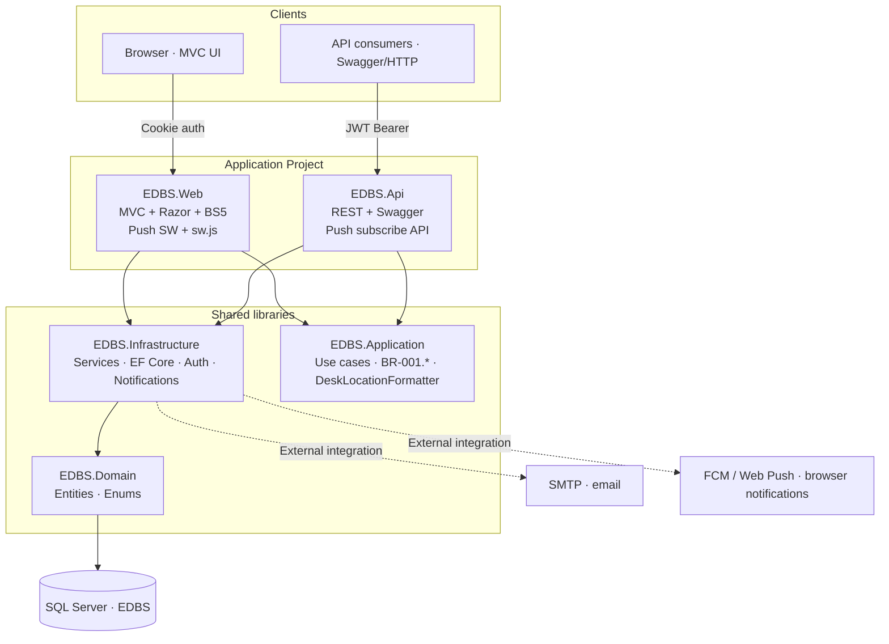
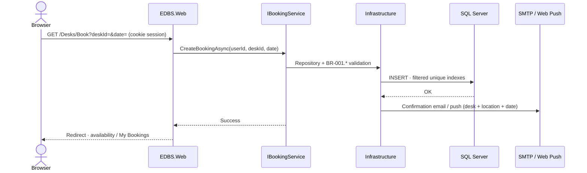
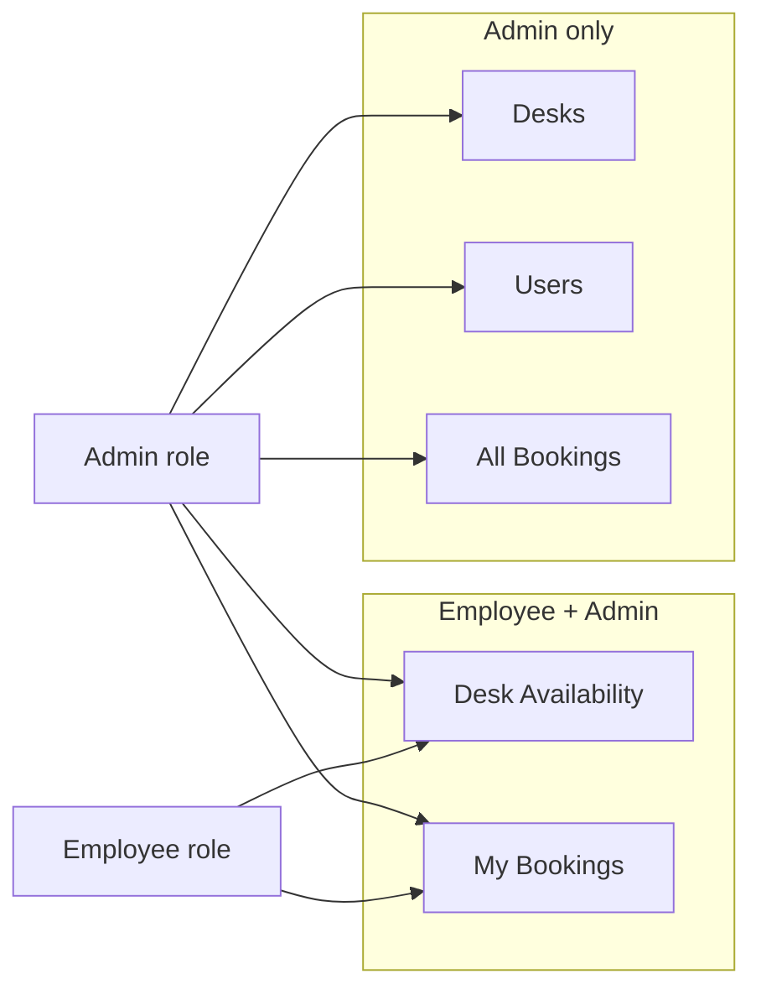
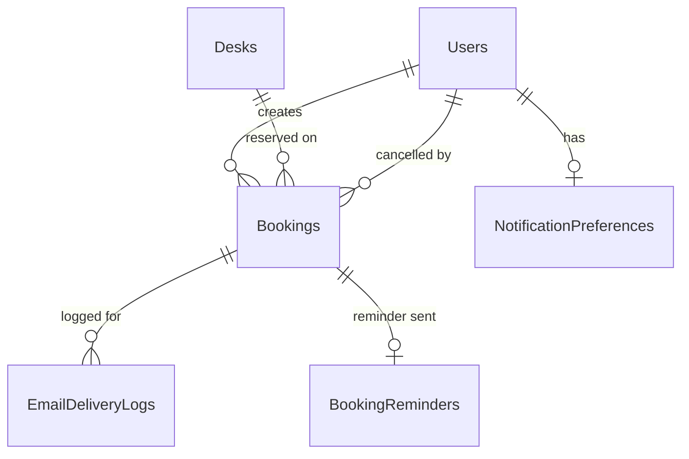

# Technical Specification — Employee Desk Booking System


|                 |                                                                                                                        |
| --------------- | ---------------------------------------------------------------------------------------------------------------------- |
| **Document ID** | TSD-001                                                                                                                |
| **Version**     | 1.7                                                                                                                    |
| **Date**        | 2026-08-24                                                                                                             |
| **Status**      | As-built — dual presentation hosts (Web + Api → shared Application/Infrastructure)                                     |
| **Traces to**   | BRD-001 v1.1, SRS-001 v1.1, US-001 … US-009                                                                            |
| **Related**     | `[app-architecture.md](app-architecture.md)`, `[db-design.md](db-design.md)`, `[../specs/index.md](../specs/index.md)` |


---

## 1. Purpose

This document is the **Technical Specification** for the Employee Desk Booking System (EDBS): a single-office web application that lets hybrid employees reserve desks and lets administrators manage bookings, desk inventory, and user accounts.

It consolidates architecture, technology choices, data model, API surface, UI routes, business rules, configuration, and operational behaviour into one reference for developers, QA, DevOps, and technical stakeholders.

**Source-of-truth hierarchy (when documents conflict):**

1. EF Core migrations (`src/EmployeeDeskBooking.Infrastructure/Data/Migrations/`)
2. OpenAPI / Swagger (`/swagger` on the API host)
3. This TSD and companion architecture docs

---

## 2. System overview

### 2.1 Business context


| Actor            | Description                                                                                                   |
| ---------------- | ------------------------------------------------------------------------------------------------------------- |
| **Employee**     | Books, views, and cancels their own desk reservations; receives email and optional browser push notifications |
| **Admin**        | Manages all bookings, desks (number + location), and users; may book for themselves via employee flows        |
| **System**       | Enforces booking rules, sends notifications, completes past bookings, and runs reminder jobs                  |
| **API consumer** | Integrations and automated tests calling REST endpoints with JWT                                              |


### 2.2 Scope (release 1)

- Single office location
- Browser-based web UI (server-rendered MVC) plus REST API (JWT)
- Desk booking window: today through +30 calendar days, Monday–Friday only
- Desk **location** on inventory, availability, bookings, and notifications
- Admin **self-booking** (Desk Availability, My Bookings, Notification settings)
- Default seed: five desks (A-01 … A-05) plus bootstrap Admin account
- Email notifications (confirmation, cancellation, day-before reminder) including desk location
- Optional browser push (book/cancel only; reminders remain email)
- Admin-initiated password reset on dedicated page (not self-service forgot-password)

### 2.3 Out of scope

- Multi-site / multi-tenant offices
- Holiday calendar integration (open question)
- Mobile native apps
- Employee self-service password reset

### 2.4 EDBS System Architecture

Canonical topology for the Employee Desk Booking System. **Web MVC** and **REST API** are both presentation hosts; each registers **Application** and **Infrastructure** and shares the same domain services. External API consumers use JWT on the Api host; browser users use cookie auth on the Web host.

EDBS System Architecture

> **As-built (v1.5):** Both `EmployeeDeskBooking.Web` and `EmployeeDeskBooking.Api` reference Application + Infrastructure directly and inject Application services in controllers. The PNG diagram shows logical tiers; physical wiring is documented in `[app-architecture.md](app-architecture.md)`.

#### Component map


| Layer            | Component                    | Project                              | Responsibilities                                                                |
| ---------------- | ---------------------------- | ------------------------------------ | ------------------------------------------------------------------------------- |
| **Clients**      | Browser (MVC UI)             | —                                    | End users; **Cookie auth** to Web                                               |
| **Clients**      | API consumers (Swagger/HTTP) | —                                    | Integrations, tests, mobile; **JWT Bearer** to Api                              |
| **Presentation** | **EDBS.Web**                 | `EmployeeDeskBooking.Web`            | MVC + Razor + BS5 · `sw.js` service worker · calls Application services         |
| **Presentation** | **EDBS.Api**                 | `EmployeeDeskBooking.Api`            | REST + Swagger · push subscribe API · calls Application services                |
| **Libraries**    | **EDBS.Infrastructure**      | `EmployeeDeskBooking.Infrastructure` | EF Core · repositories · Auth helpers · MailKit · WebPush · hosted jobs         |
| **Libraries**    | **EDBS.Application**         | `EmployeeDeskBooking.Application`    | Application services · validators · BR-001.* (referenced by Infrastructure/Api) |
| **Libraries**    | **EDBS.Domain**              | `EmployeeDeskBooking.Domain`         | Entities · enums                                                                |
| **Data**         | SQL Server (EDBS)            | —                                    | Persistent store                                                                |
| **External**     | SMTP                         | —                                    | Transactional + reminder email                                                  |
| **External**     | FCM / Web Push               | —                                    | Browser push notifications (VAPID)                                              |


#### Connection legend


| Line style                        | Meaning                                     | Example                                                        |
| --------------------------------- | ------------------------------------------- | -------------------------------------------------------------- |
| **Cookie auth** (blue)            | Browser session to Web                      | `Browser → EDBS.Web`                                           |
| **JWT Bearer** (green)            | Token auth to Api                           | `API consumers → EDBS.Api`                                     |
| **Internal flow** (orange)        | Shared libraries between presentation hosts | `Web/Api → Application → Infrastructure → Domain → SQL Server` |
| **External integration** (dashed) | Outbound from Infrastructure                | `Infrastructure ↔ SMTP · Web Push`                             |


#### Architecture diagram (Mermaid)




#### Booking request flow (employee or admin self-book via Web)




#### Role-based navigation (Web)




Employee-facing nav links use `asp-area=""` so routes resolve to `/Desks/Availability` and `/MyBookings` from Admin area pages.

#### ASCII reference (plain-text viewers)

```
┌─────────────────── Clients ───────────────────┐
│  Browser (MVC UI)     API consumers (JWT)    │
└─────────┬───────────────────────┬────────────┘
          │ Cookie auth           │ JWT Bearer
          ▼                       ▼
┌───────── Presentation ────────────────────────┐
│  EDBS.Web (MVC·Razor·BS5)   EDBS.Api (REST)  │
│  sw.js · Push SW            Swagger           │
└─────────┬───────────────────────┬────────────┘
          │                       │
          └───────────┬───────────┘
                      ▼ Internal flow
          EDBS.Application + EDBS.Infrastructure
                      │
                      ▼
          EDBS.Domain · Entities · Enums
                      │
                      ▼
              SQL Server (EDBS)
          ┌───────────┴───────────┐
          ▼                       ▼
    SMTP (email)          FCM / Web Push
```

For layer rules and module detail, see `[app-architecture.md](app-architecture.md)`.

---

## 3. Technology stack


| Layer            | Technology                                       | Version |
| ---------------- | ------------------------------------------------ | ------- |
| Runtime          | .NET                                             | 8.0     |
| Web UI           | ASP.NET Core MVC, Razor, Bootstrap 5, custom CSS | 8.0     |
| API              | ASP.NET Core Web API, Swashbuckle (OpenAPI)      | 8.0     |
| ORM              | Entity Framework Core                            | 8.0.11  |
| Database         | Microsoft SQL Server (LocalDB in development)    | —       |
| Password hashing | ASP.NET Identity Core `IPasswordHasher<User>`    | 8.0     |
| Email            | MailKit (SMTP) / file-drop mode for local dev    | 4.17+   |
| Push             | WebPush (VAPID)                                  | 1.0.12  |
| Auth (Web)       | Cookie authentication                            | —       |
| Auth (API)       | JWT Bearer                                       | —       |
| Testing          | xUnit, WebApplicationFactory integration tests   | —       |


---

## 4. Solution structure

```
EmployeeDeskBooking.sln
├── src/
│   ├── EmployeeDeskBooking.Domain/           # Entities, enums (no dependencies)
│   ├── EmployeeDeskBooking.Application/      # Use cases, interfaces, DTOs, business rules
│   ├── EmployeeDeskBooking.Infrastructure/   # EF Core, repositories, email, push, hosted jobs
│   ├── EmployeeDeskBooking.Web/              # MVC UI host (cookies) — registers Application + Infrastructure
│   └── EmployeeDeskBooking.Api/              # REST host (JWT) — registers Application + Infrastructure
└── tests/
    └── EmployeeDeskBooking.Tests/            # Integration + unit tests
```

### 4.1 Layered architecture (N-tier)

```
Browser → Web MVC ──► Application ──► Domain
API clients → Api ──► Application ──► Domain
                           ▲
                    Infrastructure ──► Domain
                           ↓
                      SQL Server
```

**Rules:**

- **Web** and **Api** are thin presentation hosts — both register `AddApplication()` and `AddInfrastructure()` in `Program.cs`
- Controllers in Web and Api inject **Application services** (`IBookingService`, `IUserAdminService`, etc.) — never `AppDbContext`
- **Domain** has zero references to other projects
- **Infrastructure** implements Application interfaces (repositories, email, push, hosted jobs)
- External API consumers call **Api** with JWT; browser users use **Web** with cookie sessions
- Web does **not** proxy domain operations through Api over HTTP (both hosts share the same service layer)

---

## 5. Domain model

### 5.1 Core entities


| Entity                     | Key fields                                                                                       | Notes                                                        |
| -------------------------- | ------------------------------------------------------------------------------------------------ | ------------------------------------------------------------ |
| **User**                   | `Id`, `Email`, `Name`, `PasswordHash`, `Role`, `IsActive`                                        | Roles: `Employee`, `Admin`                                   |
| **Desk**                   | `Id`, `DeskNumber`, `DeskNumberNormalized`, `Location`, `Status`                                 | `Location` max 100 chars; defaults from desk prefix if blank |
| **Booking**                | `Id`, `UserId`, `DeskId`, `BookingDate`, `Status`, `CancelledAt`, `CancelledById`, `CompletedAt` | Status: `Confirmed`, `Cancelled`, `Completed`                |
| **NotificationPreference** | `UserId`, `PushOptIn`, `PushSubscription`                                                        | One row per user                                             |
| **BookingReminder**        | `BookingId`, `SentAt`                                                                            | Idempotency for day-before emails                            |
| **EmailDeliveryLog**       | `Id`, `BookingId`, `UserId`, `EmailType`, `Recipient`, `Status`, `ErrorMessage`                  | Audit trail for email sends                                  |


### 5.2 Booking lifecycle

```
Confirmed ──cancel──► Cancelled
     │
     └── (BookingDate < today, office local) ──► Completed
```

### 5.3 Desk location (`DeskLocationFormatter`)


| Concern          | Implementation                                                                           |
| ---------------- | ---------------------------------------------------------------------------------------- |
| Storage          | `Desks.Location` (`nvarchar(100)`); may be empty string                                  |
| Add/edit         | Admin sets optional location on SCR-005; normalized via `NormalizeStoredLocation`        |
| Display fallback | When stored value is blank, derive from desk-number prefix (`A-01` → `Floor 1, Zone C`)  |
| Format           | `FormatDeskWithLocation` → `{deskNumber} — {location}` for UI, email, push               |
| Surfaces         | Desk Availability, My Bookings, All Bookings, confirmation banner, emails, push payloads |


---

## 6. Database design

**Engine:** Microsoft SQL Server (LocalDB in development)  
**ORM:** Entity Framework Core 8.0.11  
**Database (dev):** `EmployeeDeskBooking` on `(localdb)\mssqllocaldb`  
**Access layer:** `AppDbContext` and repositories in **Infrastructure** — Web and Api never query SQL directly  
**Office timezone:** `Office:TimeZone` in configuration (default `India Standard Time`, NFR-001)

> Full companion doc: [`db-design.md`](db-design.md). When this section and migrations disagree, **EF Core migrations win** (`src/EmployeeDeskBooking.Infrastructure/Data/Migrations/`).

### 6.1 Overview

Single-office desk booking: **users** book **desks** on **calendar dates** with a three-state lifecycle. Master data (users, desks) is admin-maintained. Notification preferences and delivery logs support email and optional browser push.

```
User 1──* Booking *──1 Desk
User 1──0..1 NotificationPreference
Booking 0──* EmailDeliveryLog (audit of send attempts)
Booking 0──0..1 BookingReminder (idempotency for day-before email)
```



### 6.2 Tables and columns

#### `Users`

Employee or Admin who can sign in. (REQ-002, REQ-004, REQ-005, REQ-018–REQ-022)

| Column | SQL Server type | Null | Notes |
| ------ | --------------- | ---- | ----- |
| `Id` | `uniqueidentifier` | NO | PK; app-generated GUID |
| `Email` | `nvarchar(320)` | NO | Display / login address |
| `EmailNormalized` | `nvarchar(320)` | NO | Lowercase trim; **unique index** (BR-001.10) |
| `Name` | `nvarchar(200)` | NO | Display name |
| `PasswordHash` | `nvarchar(500)` | NO | `IPasswordHasher<User>` — never plaintext |
| `Role` | `tinyint` | NO | `Employee` = 0, `Admin` = 1 (REQ-004) |
| `IsActive` | `bit` | NO | Default `1`; `0` = deactivated (REQ-005, REQ-020) |
| `CreatedAt` | `datetimeoffset` | NO | Audit |
| `UpdatedAt` | `datetimeoffset` | NO | Audit |

**Lifecycle:** Deactivate via `IsActive = 0`; no hard deletes (booking history). Last active Admin rule enforced in `IUserAdminService` (BR-001.11).

#### `Desks`

Bookable workspace identified by a unique desk number. (REQ-007, REQ-015–REQ-017, BR-001.17)

| Column | SQL Server type | Null | Notes |
| ------ | --------------- | ---- | ----- |
| `Id` | `uniqueidentifier` | NO | PK |
| `DeskNumber` | `nvarchar(32)` | NO | e.g. `A-01` |
| `DeskNumberNormalized` | `nvarchar(32)` | NO | Uppercase trim; **unique index** (BR-001.4, BR-001.8) |
| `Location` | `nvarchar(100)` | NO | Stored label; default `''` — UI derives from prefix when blank |
| `Status` | `tinyint` | NO | `Active` = 0, `Inactive` = 1 (REQ-017) |
| `CreatedAt` | `datetimeoffset` | NO | Audit |
| `UpdatedAt` | `datetimeoffset` | NO | Audit |

**Lifecycle:** Deactivate via `Status = Inactive` (BR-001.7); no deletes when bookings exist.

#### `Bookings`

One employee, one desk, one calendar date, one status. (REQ-008, REQ-009, BR-001.5)

| Column | SQL Server type | Null | Notes |
| ------ | --------------- | ---- | ----- |
| `Id` | `uniqueidentifier` | NO | PK |
| `UserId` | `uniqueidentifier` | NO | FK → `Users.Id` |
| `DeskId` | `uniqueidentifier` | NO | FK → `Desks.Id` |
| `BookingDate` | `date` | NO | Office-local calendar date (NFR-001) |
| `Status` | `tinyint` | NO | `Confirmed` = 0, `Cancelled` = 1, `Completed` = 2 |
| `CancelledAt` | `datetimeoffset` | YES | When cancelled |
| `CancelledById` | `uniqueidentifier` | YES | FK → `Users.Id` (self or admin) |
| `CompletedAt` | `datetimeoffset` | YES | When completed |
| `CreatedAt` | `datetimeoffset` | NO | Audit |
| `UpdatedAt` | `datetimeoffset` | NO | Audit |

**Lifecycle:**

```
Confirmed ──cancel──► Cancelled
     │
     └── (BookingDate < today, office local) ──► Completed
```

#### `NotificationPreferences`

Browser push opt-in per user. (REQ-026, REQ-027, NFR-006)

| Column | SQL Server type | Null | Notes |
| ------ | --------------- | ---- | ----- |
| `UserId` | `uniqueidentifier` | NO | PK + FK → `Users.Id` |
| `PushOptIn` | `bit` | NO | Default `0` (BR-001.15) |
| `PushSubscription` | `nvarchar(max)` | YES | JSON Web Push subscription; NULL when opted out |
| `UpdatedAt` | `datetimeoffset` | NO | Audit |

#### `BookingReminders`

Idempotency for day-before reminder emails. (REQ-025, BR-001.14)

| Column | SQL Server type | Null | Notes |
| ------ | --------------- | ---- | ----- |
| `BookingId` | `uniqueidentifier` | NO | PK + FK → `Bookings.Id` |
| `SentAt` | `datetimeoffset` | NO | Successful send timestamp |
| `CreatedAt` | `datetimeoffset` | NO | Audit |

#### `EmailDeliveryLogs`

Operational log for transactional email attempts. (NFR-005)

| Column | SQL Server type | Null | Notes |
| ------ | --------------- | ---- | ----- |
| `Id` | `uniqueidentifier` | NO | PK |
| `BookingId` | `uniqueidentifier` | YES | FK → `Bookings.Id` |
| `UserId` | `uniqueidentifier` | YES | FK → `Users.Id` |
| `EmailType` | `tinyint` | NO | Confirmation, Cancellation, Reminder |
| `Recipient` | `nvarchar(320)` | NO | Address attempted |
| `Status` | `tinyint` | NO | Sent, Failed |
| `ErrorMessage` | `nvarchar(max)` | YES | Provider error (no secrets) |
| `CreatedAt` | `datetimeoffset` | NO | Audit |

### 6.3 Critical constraints and indexes

| Rule | Enforcement |
| ---- | ----------- |
| One confirmed booking per employee per date (BR-001.1) | Filtered unique index on `(UserId, BookingDate)` WHERE `Status = 0` |
| One confirmed booking per desk per date (V-04) | Filtered unique index on `(DeskId, BookingDate)` WHERE `Status = 0` |
| Unique email (case-insensitive, BR-001.10) | Unique index on `Users.EmailNormalized` |
| Unique desk number (case-insensitive, BR-001.8) | Unique index on `Desks.DeskNumberNormalized` |
| Admin filters / my bookings | Non-unique indexes on `(BookingDate, Status)` and `(UserId, BookingDate)` |

**Filtered unique indexes (as-built SQL):**

```sql
-- BR-001.1: one confirmed booking per employee per date
CREATE UNIQUE INDEX IX_Bookings_UserId_BookingDate_Confirmed
ON Bookings (UserId, BookingDate)
WHERE Status = 0;

-- V-04: one confirmed booking per desk per date
CREATE UNIQUE INDEX IX_Bookings_DeskId_BookingDate_Confirmed
ON Bookings (DeskId, BookingDate)
WHERE Status = 0;
```

**Application-enforced rules** (not DB constraints): BR-001.6 cancel eligibility, BR-001.9 desk deactivate guard, BR-001.11 last active Admin.

**Concurrent booking (RISK-004):** `CreateBookingAsync` runs inside an EF transaction; unique-index violation → `DbUpdateException` → HTTP 409 / MVC error state.

### 6.4 EF Core mapping

| Concern | Implementation |
| ------- | -------------- |
| Configurations | Fluent API in `UserConfiguration`, `DeskConfiguration`, `BookingConfiguration`, `NotificationConfigurations.cs` |
| Filtered indexes | `HasIndex(...).HasFilter("[Status] = 0")` in `BookingConfiguration` |
| Enums | Stored as `tinyint` via `.HasConversion<byte>()` |
| Normalized columns | `EmailNormalized`, `DeskNumberNormalized` set in Application layer before persist |
| Push subscription | JSON validated in Application before persist |
| Connection string | `ConnectionStrings:DefaultConnection` in `appsettings.json` |

**Add migration:**

```bash
dotnet ef migrations add <Name> \
  --project src/EmployeeDeskBooking.Infrastructure \
  --startup-project src/EmployeeDeskBooking.Web
```

### 6.5 Migrations (applied order)

| Migration | Purpose |
| --------- | ------- |
| `InitialUsers` | `Users` table |
| `AddDesksAndBookings` | `Desks`, `Bookings`, filtered unique indexes |
| `AddEmailNotifications` | `EmailDeliveryLogs`, `BookingReminders` |
| `AddNotificationPreferences` | `NotificationPreferences` |
| `AddDeskLocation` | `Desks.Location` column |

Migrations apply automatically on startup via `InitializeDatabaseAsync`.

### 6.6 Seed data (`DbInitializer`)

| Item | Default |
| ---- | ------- |
| Admin account | `admin@trigent.com` / `Password1!` |
| Employee account | `vishal_h@trigent.com` / `Password1!` |
| Default desks | `A-01` … `A-05` (5 active desks, locations derived when blank) |
| Extra desks | Removed on startup if no bookings; desks beyond default set deactivated if they have booking history |

Legacy sample users (`admin@company.com`, `employee@company.com`) are removed on startup.

---

## 7. Application services


| Interface                        | Responsibility                                          | User stories           |
| -------------------------------- | ------------------------------------------------------- | ---------------------- |
| `IAuthService`                   | Validate credentials, sign-in result                    | US-001                 |
| `IBookingService`                | Availability, create/cancel bookings, admin list/cancel | US-002, US-003, US-004 |
| `IBookingCompletionService`      | Mark past confirmed bookings as completed               | US-009                 |
| `IDeskService`                   | CRUD desks, activate/deactivate, location               | US-005                 |
| `IUserAdminService`              | User CRUD, activate/deactivate, reset password          | US-006, REQ-028        |
| `IBookingEmailService`           | Confirmation and cancellation emails                    | US-007                 |
| `IReminderEmailService`          | Day-before reminder batch                               | US-007                 |
| `INotificationPreferenceService` | Push opt-in/out, subscription storage                   | US-008                 |
| `IBookingPushService`            | Push on book/cancel                                     | US-008                 |
| `IOfficeClock`                   | Office-local “today”, working-day checks                | NFR-001                |


---

## 8. Authentication and authorization

### 8.1 Web (cookie-based MVC host)


| Concern             | Implementation                                                                                          |
| ------------------- | ------------------------------------------------------------------------------------------------------- |
| Registration        | `AddApplication()` + `AddInfrastructure()` in `Program.cs`                                              |
| Sign-in             | `POST /Account/Login` → `IAuthService.SignInAsync` → cookie session with role claim                     |
| Sign-out            | `POST /Account/Logout` → clears authentication cookie                                                   |
| Cookie              | HttpOnly, SameSite=Strict, Secure in production                                                         |
| Post-login redirect | Employee → `/Desks/Availability`; Admin → `/Admin/AdminBookings`                                        |
| Deactivated account | Sign-in rejected with deactivated message (SCR-001 ST-04)                                               |
| Invalid credentials | Generic error (no user enumeration)                                                                     |
| Authorization       | `[Authorize(Roles = "Employee,Admin")]` on employee flows; `[Authorize(Roles = "Admin")]` on Admin area |


### 8.2 API (JWT Bearer)


| Concern          | Implementation                                   |
| ---------------- | ------------------------------------------------ |
| Token issue      | `POST /api/auth/login`                           |
| Claims           | `sub`, `email`, `name`, `role`                   |
| Protected routes | All `/api/*` except login                        |
| Admin routes     | `[Authorize(Roles = "Admin")]` on `/api/admin/*` |


### 8.3 Role matrix


| Capability                | Employee | Admin                 |
| ------------------------- | -------- | --------------------- |
| Desk Availability / book  | ✓        | ✓ (personal booking)  |
| My Bookings               | ✓        | ✓ (personal bookings) |
| Notification settings     | ✓        | ✓                     |
| All Bookings (admin view) | ✗        | ✓                     |
| Manage desks              | ✗        | ✓                     |
| Manage users              | ✗        | ✓                     |


Employee-facing controllers use `[Authorize(Roles = "Employee,Admin")]` so Admins can book for themselves.

---

## 9. Web UI specification

**Host (dev):** `http://localhost:5198`  
**Framework:** ASP.NET Core MVC, Razor views, Bootstrap 5, custom CSS (`wwwroot/css/site.css`, `wwwroot/css/edbs.css`)

### 9.1 Routes and screens


| Route                             | Controller                       | Screen                                            | Roles           |
| --------------------------------- | -------------------------------- | ------------------------------------------------- | --------------- |
| `/Account/Login`                  | `AccountController`              | Sign in                                           | Anonymous       |
| `/Desks/Availability`             | `DesksController`                | Desk Availability (SCR-002)                       | Employee, Admin |
| `/Desks/Book`                     | `DesksController`                | Book desk (GET — creates booking, redirects)      | Employee, Admin |
| `/MyBookings`                     | `MyBookingsController`           | My Bookings (SCR-003)                             | Employee, Admin |
| `/Settings/Notifications`         | `NotificationSettingsController` | Push settings (SCR-007)                           | Employee, Admin |
| `/Admin/AdminBookings`            | `AdminBookingsController`        | All Bookings (SCR-004)                            | Admin           |
| `/Admin/AdminDesks`               | `AdminDesksController`           | Manage desks — number, location, status (SCR-005) | Admin           |
| `/Admin/AdminUsers`               | `AdminUsersController`           | Manage users (SCR-006)                            | Admin           |
| `/Admin/AdminUsers/ResetPassword` | `AdminUsersController`           | Reset password form (new + confirm)               | Admin           |
| `POST /Admin/AdminUsers/Activate` | `AdminUsersController`           | Reactivate deactivated user (Web only)            | Admin           |


### 9.2 Navigation

**Employee nav:** Desk Availability · My Bookings

**Admin nav:** Desk Availability · My Bookings · Desks · Users · All Bookings

Employee-facing nav links use `asp-area=""` so they resolve to root routes (`/Desks/Availability`, `/MyBookings`) even when the user is on an Admin area page.

### 9.3 Key UI behaviours


| Feature         | Behaviour                                                                                                                   |
| --------------- | --------------------------------------------------------------------------------------------------------------------------- |
| Book desk       | Select date → check availability → book available desk                                                                      |
| Change desk     | Cancel existing booking, then book another (no in-place swap)                                                               |
| Manage desks    | Add/edit desk number and location; activate/deactivate                                                                      |
| Reset password  | Dedicated page; Admin enters **new password** + **confirm password**; must match; password not emailed (REQ-021, BR-001.12) |
| Reactivate user | **Activate** action on Manage users (Web MVC only; not yet on REST API)                                                     |
| Admin filters   | All Bookings filterable by office date and status                                                                           |
| CSRF            | Anti-forgery tokens on all MVC POST forms                                                                                   |


---

## 10. REST API specification

**Host (dev):** `http://localhost:5285` (HTTP) / `https://localhost:7164` (HTTPS)  
**Documentation:** Swagger UI at `/swagger` (Development)

### 10.1 Auth


| Method | Route             | Auth      | Description |
| ------ | ----------------- | --------- | ----------- |
| POST   | `/api/auth/login` | Anonymous | Returns JWT |


### 10.2 Bookings (Employee + Admin)


| Method | Route                              | Description                |
| ------ | ---------------------------------- | -------------------------- |
| GET    | `/api/bookings/availability?date=` | Desk availability for date |
| POST   | `/api/bookings`                    | Create booking             |
| GET    | `/api/bookings/mine`               | Current user's bookings    |
| POST   | `/api/bookings/{id}/cancel`        | Cancel own booking         |


### 10.3 Admin


| Method   | Route                                  | Description                                   |
| -------- | -------------------------------------- | --------------------------------------------- |
| GET      | `/api/admin/bookings`                  | All bookings (optional date/status filters)   |
| POST     | `/api/admin/bookings/{id}/cancel`      | Admin cancel                                  |
| GET/POST | `/api/admin/desks`                     | List / create desks (with optional location)  |
| PUT      | `/api/admin/desks/{id}`                | Update desk number and location               |
| POST     | `/api/admin/desks/{id}/deactivate`     | Deactivate desk                               |
| POST     | `/api/admin/desks/{id}/activate`       | Activate desk                                 |
| GET/POST | `/api/admin/users`                     | List / create users                           |
| PUT      | `/api/admin/users/{id}`                | Update user                                   |
| POST     | `/api/admin/users/{id}/deactivate`     | Deactivate user                               |
| POST     | `/api/admin/users/{id}/reset-password` | Set new password (`{ "newPassword": "..." }`) |


> **Gap (as-built):** User **activate** (`REQ-028`) is implemented on Web MVC (`POST /Admin/AdminUsers/Activate`) but not yet exposed as a REST endpoint.

### 10.4 Notifications


| Method | Route                                  | Description                     |
| ------ | -------------------------------------- | ------------------------------- |
| GET    | `/api/notifications/preferences`       | Get push preferences            |
| PUT    | `/api/notifications/preferences`       | Update push opt-in              |
| POST   | `/api/notifications/push-subscription` | Save Web Push subscription JSON |


### 10.5 HTTP status conventions


| Code    | Usage                                                |
| ------- | ---------------------------------------------------- |
| 200/201 | Success                                              |
| 400     | Validation error                                     |
| 401/403 | Auth / authorization failure                         |
| 404     | Resource not found                                   |
| 409     | Conflict (duplicate desk/email, booking concurrency) |
| 422     | Domain rejection (invalid date, business rule)       |


---

## 11. Business rules


| ID        | Rule                                                               | Enforcement                                                            |
| --------- | ------------------------------------------------------------------ | ---------------------------------------------------------------------- |
| BR-001.1  | One confirmed booking per employee per date                        | DB filtered unique index + service                                     |
| BR-001.2  | Change desk = cancel then book                                     | Application service                                                    |
| BR-001.3  | Bookings only Mon–Fri                                              | `IOfficeClock.IsWorkingDay`                                            |
| BR-001.4  | Unique desk numbers                                                | DB unique index on normalized number                                   |
| BR-001.5  | Status lifecycle Confirmed → Cancelled or Completed                | Service + completion job                                               |
| BR-001.6  | Cancel only today or future confirmed bookings                     | Service                                                                |
| BR-001.7  | Inactive desks excluded from availability                          | Repository query                                                       |
| BR-001.8  | Desk number uniqueness on create/edit                              | Service + DB                                                           |
| BR-001.9  | Cannot deactivate desk with future confirmed bookings              | `IDeskService`                                                         |
| BR-001.10 | Unique email on user create/edit                                   | Service + DB                                                           |
| BR-001.11 | Cannot remove last active Admin                                    | `IUserAdminService`                                                    |
| BR-001.12 | Admin enters new + confirm password on dedicated page; not emailed | Web `ResetPassword` view + `POST /api/admin/users/{id}/reset-password` |
| BR-001.13 | Mandatory booking emails (confirm, cancel)                         | `IBookingEmailService`                                                 |
| BR-001.14 | One reminder email per booking                                     | `BookingReminders` table + `ReminderEmailHostedService`                |
| BR-001.15 | Push opt-out by default                                            | `NotificationPreferences.PushOptIn = false`                            |
| BR-001.16 | No push for day-before reminders                                   | Email only in reminder job                                             |
| BR-001.17 | Desk location stored or derived from desk-number prefix            | `DeskLocationFormatter`                                                |


### 11.1 Booking date validation

- Date must be ≥ today (office timezone)
- Date must be ≤ today + 30 days
- Date must be a working day (Monday–Friday)

### 11.2 Password policy (V-12)

Minimum 8 characters with uppercase, lowercase, digit, and special character (BRD-001 V-12, resolved 2026-08-21). **As-built:** create and reset paths currently enforce non-empty password only; full complexity validation is a known gap before Gate 3.

---

## 12. Notifications

### 12.1 Email (MailKit)


| Event        | Trigger                     | Template                                                         |
| ------------ | --------------------------- | ---------------------------------------------------------------- |
| Confirmation | Booking created (Confirmed) | Desk + location + date via `FormatDeskWithLocation`              |
| Cancellation | Booking cancelled           | Desk + location + date                                           |
| Reminder     | Day before booking date     | Desk + location + date; sent once per booking via idempotent job |


**Configuration:** `Email` / `Smtp` section in `appsettings.json`; optional `appsettings.Development.local.json` for credentials.

**Failure handling:** Logged to `EmailDeliveryLogs`; booking still commits if email fails.

### 12.2 Browser push (WebPush)


| Event             | Trigger                                                                    |
| ----------------- | -------------------------------------------------------------------------- |
| Book confirmed    | If user opted in and subscription stored; payload includes desk + location |
| Booking cancelled | If user opted in; payload includes desk + location                         |


VAPID keys configured under `Push` section. Day-before reminders are **email only**.

---

## 13. Background jobs


| Service                             | Schedule                                | Purpose                       |
| ----------------------------------- | --------------------------------------- | ----------------------------- |
| `CompletePastBookingsHostedService` | Daily ~00:05 office local               | US-009: Confirmed → Completed |
| `ReminderEmailHostedService`        | Daily 08:00 office local (configurable) | US-007: day-before emails     |


Both use `IOfficeClock` / configured `Office:TimeZone`. Disabled in `Testing` environment.

---

## 14. Configuration reference

### 14.1 Key settings (`appsettings.json`)


| Section                               | Keys                                           | Purpose             |
| ------------------------------------- | ---------------------------------------------- | ------------------- |
| `ConnectionStrings:DefaultConnection` | SQL Server connection                          | Database            |
| `Office:TimeZone`                     | e.g. `India Standard Time`                     | Office-local dates  |
| `Email`                               | `Enabled`, SMTP host/port, `ReminderHourLocal` | Transactional email |
| `ReminderJob`                         | `Enabled`, `RunAtLocalTime`                    | Reminder schedule   |
| `Push`                                | `PublicKey`, `PrivateKey`, `Subject`           | Web Push VAPID      |
| `Jwt` (Api)                           | `Issuer`, `Audience`, `SigningKey`             | API tokens          |


### 14.2 Local development

Both hosts share the same SQL Server database. For typical UI work, **Web alone is sufficient**:

```bash
# Web UI (primary dev entry point)
dotnet run --project src/EmployeeDeskBooking.Web
# → http://localhost:5198
```

Run **Api** separately when testing REST endpoints or Swagger:

```bash
dotnet run --project src/EmployeeDeskBooking.Api
# → Swagger at http://localhost:5285/swagger
```

Optional: `appsettings.Development.local.json` in Web or Api for SMTP credentials (see example files in each project).

---

## 15. Security


| Topic            | Approach                                             |
| ---------------- | ---------------------------------------------------- |
| Transport        | HTTPS in non-development environments                |
| Password storage | ASP.NET Identity hasher — never plaintext in DB      |
| CSRF             | Anti-forgery on MVC forms                            |
| Session cookies  | HttpOnly, SameSite=Strict                            |
| Authorization    | Role-based on controllers                            |
| Secrets          | User secrets / environment variables — not committed |
| Logging          | No passwords or tokens in logs                       |


---

## 16. Testing

**Project:** `tests/EmployeeDeskBooking.Tests`


| Type              | Examples                                                                                               |
| ----------------- | ------------------------------------------------------------------------------------------------------ |
| Integration (Web) | `SignInTests`, `BookDeskTests`, `AdminDesksTests`, `AdminUsersTests`, `AdminBookingsTests` (nav links) |
| Integration (API) | `ApiBookingTests`, `ApiAdminDesksTests`, `ApiAuthTests`, `ApiAdminUsersTests`                          |
| Unit              | `DeskLocationHelperTests`, email template tests                                                        |


**Test database:** `EmployeeDeskBooking_Tests` (LocalDB, `Testing` environment)

**Delivery phase note:** The full as-built branch includes AC-linked xUnit tests and `*.ac.test.js` traceability companions. During the current scaffold delivery phase, individual story PRs may ship **without new automated AC tests** when the PO defers test authoring — see `ai/project-context.md` (Testing delivery phase). Before Gate 3 release, restore AC coverage per `ai/standards/testing-standards.md`.

**Run (when tests are in scope for the branch):**

```bash
dotnet test tests/EmployeeDeskBooking.Tests
node tools/aidlc-check.mjs   # AI-DLC gate check before PR
```

---

## 17. Deployment (high level)


| Environment | Components                                                           |
| ----------- | -------------------------------------------------------------------- |
| Development | LocalDB + Kestrel (`dotnet run`)                                     |
| Production  | TBD (Gate 3) — Azure App Service or IIS + SQL Server; corporate SMTP |


Database migrations apply automatically on startup via `InitializeDatabaseAsync`.

---

## 18. Feature traceability


| Story  | Feature                                              | Status      |
| ------ | ---------------------------------------------------- | ----------- |
| US-001 | Sign in / sign out                                   | Implemented |
| US-002 | Book a desk                                          | Implemented |
| US-003 | My bookings                                          | Implemented |
| US-004 | Admin all bookings                                   | Implemented |
| US-005 | Manage desks (+ location add/edit)                   | Implemented |
| US-006 | Manage users (+ reset password page, activate)       | Implemented |
| US-007 | Booking emails + reminders (+ location in templates) | Implemented |
| US-008 | Browser push preferences (Employee + Admin)          | Implemented |
| US-009 | Auto-complete past bookings                          | Implemented |


Detailed specs: `[inception/specs/](../specs/index.md)`

---

## 19. Open items


| #   | Topic                                             | Owner           |
| --- | ------------------------------------------------- | --------------- |
| 1   | Holiday calendar                                  | PO/client       |
| 2   | Reminder send time confirmation                   | PO/client       |
| 3   | Mobile vs desktop responsive target               | PO/client       |
| 4   | Production SMTP / sender identity                 | PO/IT           |
| 5   | Production hosting topology                       | DevOps (Gate 3) |
| 6   | V-12 password complexity enforcement in all paths | PO/security     |
| 7   | REST API: `POST /api/admin/users/{id}/activate`   | Backlog         |


---

## 20. Document history


| Version | Date       | Author            | Changes                                                                                                                                                                            |
| ------- | ---------- | ----------------- | ---------------------------------------------------------------------------------------------------------------------------------------------------------------------------------- |
| 1.0     | 2026-08-23 | AI-DLC (as-built) | Initial TSD from implemented system                                                                                                                                                |
| 1.1     | 2026-08-24 | AI-DLC (as-built) | Added architecture diagrams (§2.4): system context, N-tier layers, booking flow                                                                                                    |
| 1.2     | 2026-08-24 | AI-DLC (as-built) | API-first topology: Web MVC → API → libraries (§2.4, §4.1, §8.1)                                                                                                                   |
| 1.3     | 2026-08-24 | AI-DLC (as-built) | Aligned §2.4 with EDBS System Architecture diagram (Web → Api → Infrastructure → Domain)                                                                                           |
| 1.4     | 2026-08-24 | AI-DLC (as-built) | Corrected topology: dual presentation hosts both reference Application + Infrastructure directly                                                                                   |
| 1.5     | 2026-08-24 | AI-DLC (as-built) | Aligned to BRD/SRS v1.1: desk location (BR-001.17), Admin self-booking, reset-password page, user activate, five-desk seed, nav diagram, Web auth fix, API gap notes, dev workflow |
| 1.6     | 2026-08-24 | AI-DLC (as-built) | Synced companion docs: `edbs.css` in §9; delivery-phase testing note in §16                                                                                                        |
| 1.7     | 2026-08-24 | AI-DLC (as-built) | Expanded §6 with full DB design: ER diagram, all tables/columns, indexes, EF mapping, migrations, seed data                                                                        |


---

## Appendix A — Project references


| Document              | Path                                                            |
| --------------------- | --------------------------------------------------------------- |
| Business requirements | `inception/product/requirements/BRD-001-desk-booking.md` (v1.1) |
| Software requirements | `inception/product/requirements/SRS-001-desk-booking.md` (v1.1) |
| App architecture      | `inception/architecture/app-architecture.md`                    |
| DB design             | `inception/architecture/db-design.md`                           |
| Screen specs          | `inception/design/screens/`                                     |
| User stories          | `inception/stories/user-stories/`                               |
| Traceability manifest | `knowledge/traceability/manifest.json`                          |


