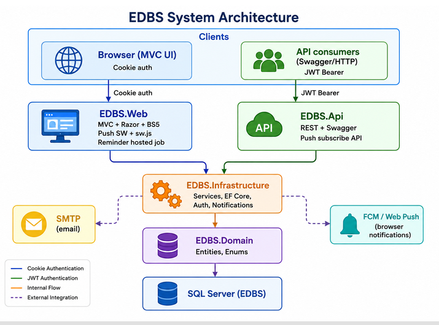
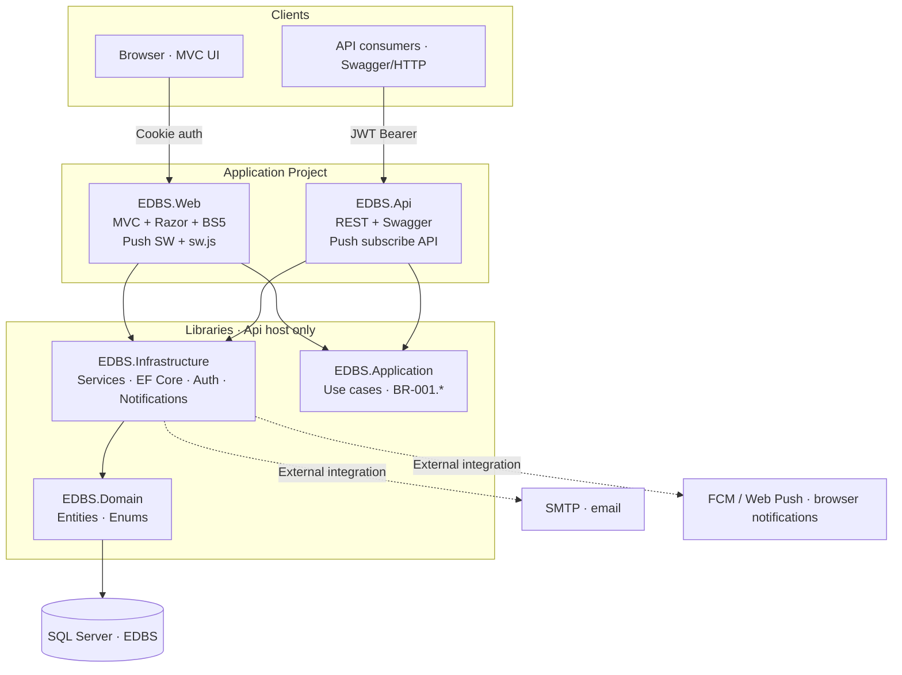
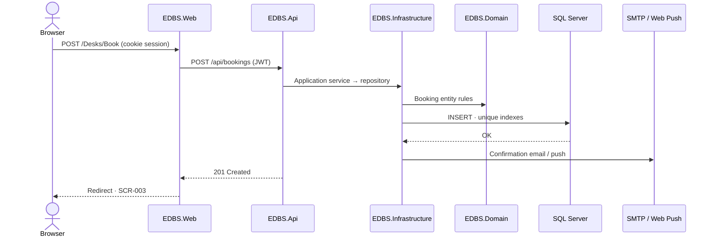

# Technical Specification — Employee Desk Booking System

| | |
| --- | --- |
| **Document ID** | TSD-001 |
| **Version** | 1.4 |
| **Date** | 2026-08-24 |
| **Status** | As-built — dual presentation hosts (Web + Api → shared libraries) |
| **Traces to** | BRD-001, SRS-001, US-001 … US-009 |
| **Related** | [`app-architecture.md`](app-architecture.md), [`db-design.md`](db-design.md), [`../specs/index.md`](../specs/index.md) |

---

## 1. Purpose

This document is the **Technical Specification** for the Employee Desk Booking System (EDBS): a single-office web application that lets hybrid employees reserve desks and lets administrators manage bookings, desk inventory, and user accounts.

It consolidates architecture, technology choices, data model, API surface, UI routes, business rules, configuration, and operational behaviour into one reference for developers, QA, DevOps, and technical stakeholders.

**Source-of-truth hierarchy (when documents conflict):**

1. EF Core migrations (`src/EmployeeDeskBooking.Infrastructure/Data/Migrations/`)
2. OpenAPI / Swagger (`/swagger` on the API host)
3. This TSD and companion architecture docs

---

## 2. System overview

### 2.1 Business context

| Actor | Description |
| ----- | ----------- |
| **Employee** | Books, views, and cancels their own desk reservations; receives email and optional browser push notifications |
| **Admin** | Manages all bookings, desks, and users; may also book desks for themselves via the same employee flows |
| **System** | Enforces booking rules, sends notifications, completes past bookings, and runs reminder jobs |

### 2.2 Scope (release 1)

- Single office location
- Browser-based web UI (server-rendered MVC) plus REST API
- Desk booking window: today through +30 calendar days, Monday–Friday only
- Email notifications (confirmation, cancellation, day-before reminder)
- Optional browser push (book/cancel only; reminders remain email)
- No self-service forgot-password flow

### 2.3 Out of scope

- Multi-site / multi-tenant offices
- Holiday calendar integration (open question)
- Mobile native apps
- Employee self-service password reset

### 2.4 EDBS System Architecture

Canonical topology for the Employee Desk Booking System. **Web MVC** and **REST API** are both presentation hosts; each registers **Application** and **Infrastructure** and shares the same domain services. External API consumers use JWT on the Api host; browser users use cookie auth on the Web host.



> **As-built (v1.1):** Both `EmployeeDeskBooking.Web` and `EmployeeDeskBooking.Api` reference Application + Infrastructure directly. The diagram above shows logical tiers; physical project references are documented in [`app-architecture.md`](app-architecture.md).

#### Component map

| Layer | Component | Project | Responsibilities |
| ----- | --------- | ------- | ---------------- |
| **Clients** | Browser (MVC UI) | — | End users; **Cookie auth** to Web |
| **Clients** | API consumers (Swagger/HTTP) | — | Integrations, tests, mobile; **JWT Bearer** to Api |
| **Presentation** | **EDBS.Web** | `EmployeeDeskBooking.Web` | MVC + Razor + BS5 · `sw.js` service worker · calls Application services |
| **Presentation** | **EDBS.Api** | `EmployeeDeskBooking.Api` | REST + Swagger · push subscribe API · calls Application services |
| **Libraries** | **EDBS.Infrastructure** | `EmployeeDeskBooking.Infrastructure` | EF Core · repositories · Auth helpers · MailKit · WebPush · hosted jobs |
| **Libraries** | **EDBS.Application** | `EmployeeDeskBooking.Application` | Application services · validators · BR-001.* (referenced by Infrastructure/Api) |
| **Libraries** | **EDBS.Domain** | `EmployeeDeskBooking.Domain` | Entities · enums |
| **Data** | SQL Server (EDBS) | — | Persistent store |
| **External** | SMTP | — | Transactional + reminder email |
| **External** | FCM / Web Push | — | Browser push notifications (VAPID) |

#### Connection legend

| Line style | Meaning | Example |
| ---------- | ------- | ------- |
| **Cookie auth** (blue) | Browser session to Web | `Browser → EDBS.Web` |
| **JWT Bearer** (green) | Token auth to Api | `API consumers → EDBS.Api` |
| **Internal flow** (orange) | Shared libraries between presentation hosts | `Web/Api → Application → Infrastructure → Domain → SQL Server` |
| **External integration** (dashed) | Outbound from Infrastructure | `Infrastructure ↔ SMTP · Web Push` |

#### Architecture diagram (Mermaid)



#### Booking request flow (employee via Web)



#### ASCII reference (plain-text viewers)

```
┌─────────────────── Clients ───────────────────┐
│  Browser (MVC UI)     API consumers (JWT)    │
└─────────┬───────────────────────┬────────────┘
          │ Cookie auth           │ JWT Bearer
          ▼                       ▼
┌───────── Application Project ─────────────────┐
│  EDBS.Web          ──HTTP REST──►  EDBS.Api   │
│  MVC·Razor·BS5                    REST·Swagger│
│  sw.js · Push SW                  Push subscribe│
└───────────────────────────────┬───────────────┘
                                │ Internal flow
                                ▼
                    EDBS.Infrastructure
                    Services · EF Core · Auth · Notifications
                                │
                                ▼
                    EDBS.Domain · Entities · Enums
                                │
                                ▼
                    SQL Server (EDBS)
          ┌─────────────────────┴─────────────────────┐
          ▼                                           ▼
    SMTP (email)                          FCM / Web Push
```

For layer rules and module detail, see [`app-architecture.md`](app-architecture.md).

---

## 3. Technology stack

| Layer | Technology | Version |
| ----- | ---------- | ------- |
| Runtime | .NET | 8.0 |
| Web UI | ASP.NET Core MVC, Razor, Bootstrap 5, custom CSS | 8.0 |
| API | ASP.NET Core Web API, Swashbuckle (OpenAPI) | 8.0 |
| ORM | Entity Framework Core | 8.0.11 |
| Database | Microsoft SQL Server (LocalDB in development) | — |
| Password hashing | ASP.NET Identity Core `IPasswordHasher<User>` | 8.0 |
| Email | MailKit (SMTP) / file-drop mode for local dev | 4.17+ |
| Push | WebPush (VAPID) | 1.0.12 |
| Auth (Web) | Cookie authentication | — |
| Auth (API) | JWT Bearer | — |
| Testing | xUnit, WebApplicationFactory integration tests | — |

---

## 4. Solution structure

```
EmployeeDeskBooking.sln
├── src/
│   ├── EmployeeDeskBooking.Domain/           # Entities, enums (no dependencies)
│   ├── EmployeeDeskBooking.Application/      # Use cases, interfaces, DTOs, business rules
│   ├── EmployeeDeskBooking.Infrastructure/   # EF Core, repositories, email, push, hosted jobs
│   ├── EmployeeDeskBooking.Web/              # MVC UI host (cookies) — calls Api via HTTP
│   └── EmployeeDeskBooking.Api/              # REST gateway (JWT) — owns Application + Infrastructure
└── tests/
    └── EmployeeDeskBooking.Tests/            # Integration + unit tests
```

### 4.1 Layered architecture (N-tier)

```
Browser → Web MVC (UI only)
              ↓ HTTP REST
          Api (domain gateway)
              ↓
          Application (services, validators)
              ↓
          Domain (entities)
              ↑
          Infrastructure (EF, MailKit, WebPush, jobs)
              ↓
          SQL Server
```

**Rules:**

- **Web** calls **Api** only (typed `HttpClient` / API client) — Web does **not** reference Application or Infrastructure projects
- **Api** is the sole host that registers Application + Infrastructure and injects Application services
- Api controllers inject Application services only — never `AppDbContext`
- Domain has zero references to other projects
- External clients call Api directly with JWT; Web uses the same REST surface server-side

---

## 5. Domain model

### 5.1 Core entities

| Entity | Key fields | Notes |
| ------ | ----------- | ----- |
| **User** | `Id`, `Email`, `Name`, `PasswordHash`, `Role`, `IsActive` | Roles: `Employee`, `Admin` |
| **Desk** | `Id`, `DeskNumber`, `DeskNumberNormalized`, `Location`, `Status` | `Location` max 100 chars; defaults from desk prefix if blank |
| **Booking** | `Id`, `UserId`, `DeskId`, `BookingDate`, `Status`, `CancelledAt`, `CancelledById`, `CompletedAt` | Status: `Confirmed`, `Cancelled`, `Completed` |
| **NotificationPreference** | `UserId`, `PushOptIn`, `PushSubscription` | One row per user |
| **BookingReminder** | `BookingId`, `SentAt` | Idempotency for day-before emails |
| **EmailDeliveryLog** | `Id`, `BookingId`, `UserId`, `EmailType`, `Recipient`, `Status`, `ErrorMessage` | Audit trail for email sends |

### 5.2 Booking lifecycle

```
Confirmed ──cancel──► Cancelled
     │
     └── (BookingDate < today, office local) ──► Completed
```

### 5.3 Desk location

- Each desk stores an editable **Location** (e.g. `Floor 1, Zone C` or custom text)
- If location is empty at read time, the system derives a default from the desk number prefix (`A-01` → `Floor 1, Zone C`)
- Location appears in availability, My Bookings, booking confirmations, emails, and push notifications

---

## 6. Database design

**Engine:** SQL Server  
**Database (dev):** `EmployeeDeskBooking` on `(localdb)\mssqllocaldb`

### 6.1 Critical constraints

| Rule | Enforcement |
| ---- | ----------- |
| One confirmed booking per employee per date | Filtered unique index on `(UserId, BookingDate)` WHERE `Status = Confirmed` |
| One confirmed booking per desk per date | Filtered unique index on `(DeskId, BookingDate)` WHERE `Status = Confirmed` |
| Unique email (case-insensitive) | Unique index on `EmailNormalized` |
| Unique desk number (case-insensitive) | Unique index on `DeskNumberNormalized` |

### 6.2 Migrations (applied order)

| Migration | Purpose |
| --------- | ------- |
| `InitialUsers` | Users table |
| `AddDesksAndBookings` | Desks, Bookings, filtered unique indexes |
| `AddEmailNotifications` | EmailDeliveryLogs |
| `AddNotificationPreferences` | NotificationPreferences |
| `AddDeskLocation` | `Desks.Location` column |

### 6.3 Seed data (`DbInitializer`)

| Item | Default |
| ---- | ------- |
| Admin account | `admin@trigent.com` / `Password1!` |
| Employee account | `vishal_h@trigent.com` / `Password1!` |
| Default desks | `A-01` … `A-05` (5 active desks) |
| Extra desks | Removed on startup if no bookings; desks beyond default set deactivated if they have booking history |

Legacy sample users (`admin@company.com`, `employee@company.com`) are removed on startup.

---

## 7. Application services

| Interface | Responsibility | User stories |
| --------- | -------------- | ------------ |
| `IAuthService` | Validate credentials, sign-in result | US-001 |
| `IBookingService` | Availability, create/cancel bookings, admin list/cancel | US-002, US-003, US-004 |
| `IBookingCompletionService` | Mark past confirmed bookings as completed | US-009 |
| `IDeskService` | CRUD desks, activate/deactivate, location | US-005 |
| `IUserAdminService` | User CRUD, activate/deactivate, reset password | US-006 |
| `IBookingEmailService` | Confirmation and cancellation emails | US-007 |
| `IReminderEmailService` | Day-before reminder batch | US-007 |
| `INotificationPreferenceService` | Push opt-in/out, subscription storage | US-008 |
| `IBookingPushService` | Push on book/cancel | US-008 |
| `IOfficeClock` | Office-local “today”, working-day checks | NFR-001 |

---

## 8. Authentication and authorization

### 8.1 Web (cookie-based UI host)

| Concern | Implementation |
| ------- | -------------- |
| Role | Razor views, navigation, CSRF, browser cookie session — **no direct Application/Infrastructure references** |
| Domain access | MVC controllers call **REST API** via typed HTTP client |
| Sign-in | `POST /Account/Login` → Web calls `POST /api/auth/login` → issues browser cookie; stores JWT server-side for API calls |
| Sign-out | `POST /Account/Logout` → clears cookie and server-side API token |
| Cookie | HttpOnly, SameSite=Strict, Secure in production |
| Post-login redirect | Employee → `/Desks/Availability`; Admin → `/Admin/AdminBookings` |
| Deactivated account | API returns 403; Web shows deactivated message |
| Invalid credentials | Generic error (no user enumeration) |

### 8.2 API (JWT Bearer)

| Concern | Implementation |
| ------- | -------------- |
| Token issue | `POST /api/auth/login` |
| Claims | `sub`, `email`, `name`, `role` |
| Protected routes | All `/api/*` except login |
| Admin routes | `[Authorize(Roles = "Admin")]` on `/api/admin/*` |

### 8.3 Role matrix

| Capability | Employee | Admin |
| ---------- | -------- | ----- |
| Desk Availability / book | ✓ | ✓ (personal booking) |
| My Bookings | ✓ | ✓ (personal bookings) |
| Notification settings | ✓ | ✓ |
| All Bookings (admin view) | ✗ | ✓ |
| Manage desks | ✗ | ✓ |
| Manage users | ✗ | ✓ |

Employee-facing controllers use `[Authorize(Roles = "Employee,Admin")]` so Admins can book for themselves.

---

## 9. Web UI specification

**Host (dev):** `http://localhost:5198`  
**Framework:** ASP.NET Core MVC, Razor views, Bootstrap 5, custom CSS (`wwwroot/css/site.css`)

### 9.1 Routes and screens

| Route | Controller | Screen | Roles |
| ----- | ---------- | ------ | ----- |
| `/Account/Login` | `AccountController` | Sign in | Anonymous |
| `/Desks/Availability` | `DesksController` | Desk Availability (SCR-002) | Employee, Admin |
| `/Desks/Book` | `DesksController` | Book desk (POST redirect) | Employee, Admin |
| `/MyBookings` | `MyBookingsController` | My Bookings (SCR-003) | Employee, Admin |
| `/Settings/Notifications` | `NotificationSettingsController` | Push settings (SCR-007) | Employee, Admin |
| `/Admin/AdminBookings` | `AdminBookingsController` | All Bookings (SCR-004) | Admin |
| `/Admin/AdminDesks` | `AdminDesksController` | Manage desks (SCR-005) | Admin |
| `/Admin/AdminUsers` | `AdminUsersController` | Manage users (SCR-006) | Admin |
| `/Admin/AdminUsers/ResetPassword` | `AdminUsersController` | Reset password form | Admin |

### 9.2 Navigation

**Employee nav:** Desk Availability · My Bookings

**Admin nav:** Desk Availability · My Bookings · Desks · Users · All Bookings

Employee-facing nav links use `asp-area=""` so they resolve to root routes (`/Desks/Availability`, `/MyBookings`) even when the user is on an Admin area page.

### 9.3 Key UI behaviours

| Feature | Behaviour |
| ------- | --------- |
| Book desk | Select date → check availability → book available desk |
| Change desk | Cancel existing booking, then book another (no in-place swap) |
| Manage desks | Add/edit desk number and location; activate/deactivate |
| Reset password | Dedicated page; admin enters new + confirm password |
| Admin filters | All Bookings filterable by office date and status |
| CSRF | Anti-forgery tokens on all MVC POST forms |

---

## 10. REST API specification

**Host (dev):** configured in `launchSettings.json` for Api project  
**Documentation:** Swagger UI at `/swagger` (Development)

### 10.1 Auth

| Method | Route | Auth | Description |
| ------ | ----- | ---- | ----------- |
| POST | `/api/auth/login` | Anonymous | Returns JWT |

### 10.2 Bookings (Employee + Admin)

| Method | Route | Description |
| ------ | ----- | ----------- |
| GET | `/api/bookings/availability?date=` | Desk availability for date |
| POST | `/api/bookings` | Create booking |
| GET | `/api/bookings/mine` | Current user's bookings |
| POST | `/api/bookings/{id}/cancel` | Cancel own booking |

### 10.3 Admin

| Method | Route | Description |
| ------ | ----- | ----------- |
| GET | `/api/admin/bookings` | All bookings (optional date/status filters) |
| POST | `/api/admin/bookings/{id}/cancel` | Admin cancel |
| GET/POST | `/api/admin/desks` | List / create desks (with optional location) |
| PUT | `/api/admin/desks/{id}` | Update desk number and location |
| POST | `/api/admin/desks/{id}/deactivate` | Deactivate desk |
| POST | `/api/admin/desks/{id}/activate` | Activate desk |
| GET/POST | `/api/admin/users` | List / create users |
| PUT | `/api/admin/users/{id}` | Update user |
| POST | `/api/admin/users/{id}/deactivate` | Deactivate user |
| POST | `/api/admin/users/{id}/reset-password` | Set new password (`{ "newPassword": "..." }`) |

### 10.4 Notifications

| Method | Route | Description |
| ------ | ----- | ----------- |
| GET | `/api/notifications/preferences` | Get push preferences |
| PUT | `/api/notifications/preferences` | Update push opt-in |
| POST | `/api/notifications/push-subscription` | Save Web Push subscription JSON |

### 10.5 HTTP status conventions

| Code | Usage |
| ---- | ----- |
| 200/201 | Success |
| 400 | Validation error |
| 401/403 | Auth / authorization failure |
| 404 | Resource not found |
| 409 | Conflict (duplicate desk/email, booking concurrency) |
| 422 | Domain rejection (invalid date, business rule) |

---

## 11. Business rules

| ID | Rule | Enforcement |
| -- | ---- | ----------- |
| BR-001.1 | One confirmed booking per employee per date | DB filtered unique index + service |
| BR-001.2 | Change desk = cancel then book | Application service |
| BR-001.3 | Bookings only Mon–Fri | `IOfficeClock.IsWorkingDay` |
| BR-001.4 | Unique desk numbers | DB unique index on normalized number |
| BR-001.5 | Status lifecycle Confirmed → Cancelled or Completed | Service + completion job |
| BR-001.6 | Cancel only today or future confirmed bookings | Service |
| BR-001.7 | Inactive desks excluded from availability | Repository query |
| BR-001.8 | Desk number uniqueness on create/edit | Service + DB |
| BR-001.9 | Cannot deactivate desk with future confirmed bookings | `IDeskService` |
| BR-001.10 | Unique email on user create/edit | Service + DB |
| BR-001.11 | Cannot remove last active Admin | `IUserAdminService` |
| BR-001.12 | Admin-initiated password reset (not self-service) | Dedicated reset page / API |
| BR-001.14 | One reminder email per booking | `BookingReminders` table |
| BR-001.15 | Push opt-out by default | `NotificationPreferences.PushOptIn = false` |

### 11.1 Booking date validation

- Date must be ≥ today (office timezone)
- Date must be ≤ today + 30 days
- Date must be a working day (Monday–Friday)

### 11.2 Password policy (V-12)

Minimum 8 characters with uppercase, lowercase, digit, and special character (enforced on create; admin reset accepts any non-empty password from admin form).

---

## 12. Notifications

### 12.1 Email (MailKit)

| Event | Trigger | Template |
| ----- | ------- | -------- |
| Confirmation | Booking created (Confirmed) | Subject/body include desk + location + date |
| Cancellation | Booking cancelled | Subject/body include desk + date |
| Reminder | Day before booking date | Sent once per booking via idempotent job |

**Configuration:** `Email` / `Smtp` section in `appsettings.json`; optional `appsettings.Development.local.json` for credentials.

**Failure handling:** Logged to `EmailDeliveryLogs`; booking still commits if email fails.

### 12.2 Browser push (WebPush)

| Event | Trigger |
| ----- | ------- |
| Book confirmed | If user opted in and subscription stored |
| Booking cancelled | If user opted in |

VAPID keys configured under `Push` section. Day-before reminders are **email only**.

---

## 13. Background jobs

| Service | Schedule | Purpose |
| ------- | -------- | ------- |
| `CompletePastBookingsHostedService` | Daily ~00:05 office local | US-009: Confirmed → Completed |
| `ReminderEmailHostedService` | Daily 08:00 office local (configurable) | US-007: day-before emails |

Both use `IOfficeClock` / configured `Office:TimeZone`. Disabled in `Testing` environment.

---

## 14. Configuration reference

### 14.1 Key settings (`appsettings.json`)

| Section | Keys | Purpose |
| ------- | ---- | ------- |
| `ConnectionStrings:DefaultConnection` | SQL Server connection | Database |
| `Office:TimeZone` | e.g. `India Standard Time` | Office-local dates |
| `Email` | `Enabled`, SMTP host/port, `ReminderHourLocal` | Transactional email |
| `ReminderJob` | `Enabled`, `RunAtLocalTime` | Reminder schedule |
| `Push` | `PublicKey`, `PrivateKey`, `Subject` | Web Push VAPID |
| `Jwt` (Api) | `Issuer`, `Audience`, `SigningKey` | API tokens |

### 14.2 Local development

Both hosts must run — Web calls Api over HTTP:

```bash
# API (start first — domain gateway)
dotnet run --project src/EmployeeDeskBooking.Api
# → Swagger at /swagger

# Web UI (calls Api via configured base URL)
dotnet run --project src/EmployeeDeskBooking.Web
# → http://localhost:5198
```

Configure `Api:BaseUrl` (or equivalent) in Web `appsettings.Development.json` to point at the running Api host.

Optional: `appsettings.Development.local.json` for SMTP credentials (see example file in Web project).

---

## 15. Security

| Topic | Approach |
| ----- | -------- |
| Transport | HTTPS in non-development environments |
| Password storage | ASP.NET Identity hasher — never plaintext in DB |
| CSRF | Anti-forgery on MVC forms |
| Session cookies | HttpOnly, SameSite=Strict |
| Authorization | Role-based on controllers |
| Secrets | User secrets / environment variables — not committed |
| Logging | No passwords or tokens in logs |

---

## 16. Testing

**Project:** `tests/EmployeeDeskBooking.Tests`

| Type | Examples |
| ---- | -------- |
| Integration (Web) | `SignInTests`, `BookDeskTests`, `AdminDesksTests`, `AdminUsersTests` |
| Integration (API) | `ApiBookingTests`, `ApiAdminDesksTests`, `ApiAuthTests` |
| Unit | `DeskLocationHelperTests`, email template tests |

**Test database:** `EmployeeDeskBooking_Tests` (LocalDB, `Testing` environment)

**Run:**

```bash
dotnet test tests/EmployeeDeskBooking.Tests
node tools/aidlc-check.mjs   # AI-DLC gate check before PR
```

---

## 17. Deployment (high level)

| Environment | Components |
| ----------- | ---------- |
| Development | LocalDB + Kestrel (`dotnet run`) |
| Production | TBD (Gate 3) — Azure App Service or IIS + SQL Server; corporate SMTP |

Database migrations apply automatically on startup via `InitializeDatabaseAsync`.

---

## 18. Feature traceability

| Story | Feature | Status |
| ----- | ------- | ------ |
| US-001 | Sign in / sign out | Implemented |
| US-002 | Book a desk | Implemented |
| US-003 | My bookings | Implemented |
| US-004 | Admin all bookings | Implemented |
| US-005 | Manage desks (+ location) | Implemented |
| US-006 | Manage users (+ reset password page) | Implemented |
| US-007 | Booking emails + reminders | Implemented |
| US-008 | Browser push preferences | Implemented |
| US-009 | Auto-complete past bookings | Implemented |

Detailed specs: [`inception/specs/`](../specs/index.md)

---

## 19. Open items

| # | Topic | Owner |
| - | ----- | ----- |
| 1 | Holiday calendar | PO/client |
| 2 | Reminder send time confirmation | PO/client |
| 3 | Mobile vs desktop responsive target | PO/client |
| 4 | Production SMTP / sender identity | PO/IT |
| 5 | Production hosting topology | DevOps (Gate 3) |

---

## 20. Document history

| Version | Date | Author | Changes |
| ------- | ---- | ------ | ------- |
| 1.0 | 2026-08-23 | AI-DLC (as-built) | Initial TSD from implemented system |
| 1.1 | 2026-08-24 | AI-DLC (as-built) | Added architecture diagrams (§2.4): system context, N-tier layers, booking flow |
| 1.2 | 2026-08-24 | AI-DLC (as-built) | API-first topology: Web MVC → API → libraries (§2.4, §4.1, §8.1) |
| 1.3 | 2026-08-24 | AI-DLC (as-built) | Aligned §2.4 with EDBS System Architecture diagram (Web → Api → Infrastructure → Domain) |

---

## Appendix A — Project references

| Document | Path |
| -------- | ---- |
| Business requirements | `inception/product/requirements/BRD-001-desk-booking.md` |
| App architecture | `inception/architecture/app-architecture.md` |
| DB design | `inception/architecture/db-design.md` |
| Screen specs | `inception/design/screens/` |
| User stories | `inception/stories/user-stories/` |
| Traceability manifest | `knowledge/traceability/manifest.json` |
