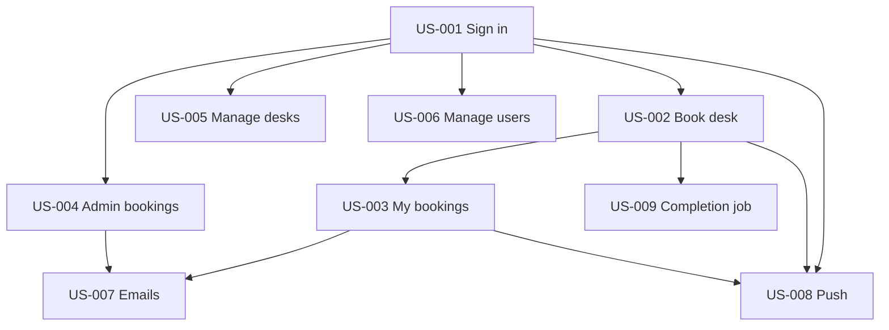

# STORIES-001 — Employee Desk Booking (all user stories)

> Consolidated user stories for **EPIC-001**. Approval = Gate 1 review of the individual story files' PRs. Delivery = each story PR merging with implementation evidence. Per-story detail also lives in `inception/stories/user-stories/US-###-*.md`; per-story dev specs in `inception/specs/US-###-*/`.

| | |
| --- | --- |
| **Document ID** | STORIES-001 |
| **Version** | 1.1 |
| **Date** | 2026-08-24 |
| **Status** | As-built — all US-001 … US-009 implemented |
| **Epic** | [EPIC-001 — Employee Desk Booking](epics/EPIC-001-desk-booking.md) |
| **Traces to** | [BRD-001 v1.1](../product/requirements/BRD-001-desk-booking.md), [SRS-001 v1.1](../product/requirements/SRS-001-desk-booking.md) |
| **Related** | [TSD-001 §18](../architecture/technical-specification.md), [spec index](../specs/index.md), [delivery plan](delivery-plan-EPIC-001.md) |

---

## 1. Purpose

This document is the **single reference for all release-1 user stories** in the Employee Desk Booking System: story statements, acceptance criteria, dependencies, screens, and as-built notes. Use it for planning, traceability reviews, and onboarding without opening nine separate files.

**Source-of-truth hierarchy (when documents conflict):**

1. Individual story files (`inception/stories/user-stories/US-###-*.md`) — Gate 1 approved text
2. This consolidated document — summary + as-built alignments (v1.1)
3. BRD-001 / SRS-001 — business and software requirements

---

## 2. Story index

| Story | Feature | Actor | Priority | Estimate | Depends on | Screen(s) | Status |
| ----- | ------- | ----- | -------- | -------- | ---------- | --------- | ------ |
| [US-001](#us-001--sign-in-and-sign-out) | Sign in and sign out | Employee, Admin | Must | 5 pts | — | SCR-001 | Implemented |
| [US-002](#us-002--book-a-desk) | Book a desk | Employee, Admin (self) | Must | 8 pts | US-001 | SCR-002 | Implemented |
| [US-003](#us-003--view-and-cancel-my-bookings) | View and cancel my bookings | Employee, Admin (self) | Must | 5 pts | US-001, US-002 | SCR-003 | Implemented |
| [US-004](#us-004--admin-view-and-cancel-all-bookings) | Admin view and cancel all bookings | Admin | Must | 5 pts | US-001 | SCR-004 | Implemented |
| [US-005](#us-005--admin-manage-desks) | Admin manage desks | Admin | Must | 5 pts | US-001 | SCR-005 | Implemented |
| [US-006](#us-006--admin-manage-users) | Admin manage users | Admin | Must | 8 pts | US-001 | SCR-006 | Implemented |
| [US-007](#us-007--send-booking-email-notifications) | Booking email notifications | System → Employee/Admin | Must | 8 pts | US-002, US-003, US-004 | — | Implemented |
| [US-008](#us-008--browser-push-notification-preferences) | Browser push preferences | Employee, Admin | Must | 5 pts | US-001, US-002, US-003 | SCR-007 | Implemented |
| [US-009](#us-009--complete-past-bookings-automatically) | Auto-complete past bookings | System | Must | 3 pts | US-002 | — | Implemented |

**Total estimate:** 54 pts (AI draft — humans re-estimate)

### 2.1 Dependency graph

### 2.2 Delivery order (summary)

See [`delivery-plan-EPIC-001.md`](delivery-plan-EPIC-001.md) for sprint hours and risks.

| Sprint | Stories |
| ------ | ------- |
| 1 | US-001, US-002 |
| 2 | US-003, US-009 |
| 3 | US-004, US-005, US-006 |
| 4 | US-007, US-008 |

---

## 3. As-built alignments (BRD v1.1)

Individual story files were drafted at Gate 1; the as-built release adds the following cross-cutting behaviours. They apply wherever noted below.

| ID | Alignment | Affects |
| -- | --------- | ------- |
| **REQ-029** | **Admin self-booking** — Admins use Desk Availability and My Bookings with the same rules as Employees | US-002, US-003, US-008 |
| **BR-001.17 / REQ-030** | **Desk location** — stored or derived from desk-number prefix; shown in availability, lists, emails, push | US-002, US-003, US-005, US-007, US-008 |
| **REQ-028** | **Reactivate user** — Admin can reactivate a deactivated account (Web MVC) | US-006 |
| **REQ-021 / BR-001.12** | **Reset password** — dedicated page; Admin enters new + confirm password; password not emailed | US-006 |
| **Seed** | Five default desks **A-01 … A-05** via `DbInitializer` | US-002, US-005 |

---

## US-001 — Sign in and sign out

| | |
| --- | --- |
| **File** | [`user-stories/US-001-sign-in.md`](user-stories/US-001-sign-in.md) |
| **Traces to** | REQ-001, REQ-002, REQ-003, REQ-004, REQ-005, NFR-003, NFR-004 |
| **Depends on** | — |

### Story

As an **Employee or Admin**
I want to sign in with my email and password and sign out when done
So that only authorised users access desk booking features.

### Acceptance criteria

#### AC-01 Employee lands on Book Desk after sign-in

- **Given** an active Employee account with valid credentials
- **When** the user submits the sign-in form
- **Then** the user is authenticated and routed to Desk Availability (SCR-002)

#### AC-02 Admin lands on All Bookings after sign-in

- **Given** an active Admin account with valid credentials
- **When** the user submits the sign-in form
- **Then** the user is authenticated and routed to Admin All Bookings (SCR-004)

#### AC-03 Invalid credentials rejected

- **Given** unknown email or wrong password
- **When** the user submits sign-in
- **Then** sign-in fails with a generic error message and no session is created (SCR-001 ST-03)

#### AC-04 Deactivated account rejected

- **Given** a user account marked deactivated
- **When** the user attempts to sign in with correct credentials
- **Then** sign-in is rejected with a deactivated-account message (SCR-001 ST-04)

#### AC-05 Sign out ends session

- **Given** a signed-in user on any authenticated screen
- **When** the user chooses Sign out
- **Then** the session ends and the user is returned to the sign-in screen

### Edge cases

- Empty email or password: client validation prevents submit or server rejects with same generic error as AC-03.
- Double submit while loading: button disabled (SCR-001 ST-02).

### UI / API

- **UI:** SCR-001 — Sign In (`inception/design/screens/SCR-001-sign-in.md`)
- **API:** `POST /api/auth/login` (JWT for API consumers); Web uses cookie session via `IAuthService`

---

## US-002 — Book a desk

| | |
| --- | --- |
| **File** | [`user-stories/US-002-book-desk.md`](user-stories/US-002-book-desk.md) |
| **Traces to** | REQ-001, REQ-003, REQ-006, REQ-007, REQ-008, REQ-029, NFR-001, NFR-002, BR-001.1, BR-001.2, BR-001.3, BR-001.4, BR-001.7, BR-001.17 |
| **Depends on** | US-001 |

### Story

As an **Employee or Admin (booking for self)**
I want to pick a working day and book one available desk by its desk number and location
So that I have a confirmed seat before I come to the office.

### Acceptance criteria

#### AC-01 Select a date within the booking window

- **Given** a signed-in user on Desk Availability
- **When** they choose a date from today through 30 calendar days ahead (office local timezone)
- **Then** the system loads desk availability for that date

#### AC-02 Reject invalid dates

- **Given** a signed-in user
- **When** they select a date before today, after today+30, or on Saturday/Sunday
- **Then** the system rejects the date and does not show bookable availability (BR-001.3, V-02, V-03)

#### AC-03 View active desks and availability

- **Given** a valid working-day date
- **When** availability loads
- **Then** each **Active** desk shows its unique desk number, **location** label, and whether it is available or booked (SCR-002 ST-03, BR-001.17)

#### AC-04 Book one available desk

- **Given** the user has no **Confirmed** booking for that date and a desk is available
- **When** they confirm booking that desk
- **Then** a **Confirmed** booking is created for that user, desk, and date (BR-001.4)

#### AC-05 Reject double booking same day

- **Given** the user already has a **Confirmed** booking on the selected date
- **When** they attempt to book another desk for the same date
- **Then** the request is rejected (BR-001.1, V-05)

#### AC-06 Inactive or taken desks not bookable

- **Given** a desk is **Inactive** or already **Confirmed** for another user on that date
- **When** the user attempts to book it
- **Then** the request is rejected (BR-001.7, V-04)

### Edge cases

- Change desk same day: must cancel existing booking first (BR-001.2) — US-003 + re-book flow.
- Concurrent book of same desk: one succeeds; other fails (RISK-004).

### UI / API

- **UI:** SCR-002 — Desk Availability (`/Desks/Availability`, `/Desks/Book`)
- **API:** `GET /api/bookings/availability`, `POST /api/bookings`

---

## US-003 — View and cancel my bookings

| | |
| --- | --- |
| **File** | [`user-stories/US-003-my-bookings.md`](user-stories/US-003-my-bookings.md) |
| **Traces to** | REQ-001, REQ-003, REQ-009, REQ-010, REQ-029, NFR-004, BR-001.5, BR-001.6, BR-001.17 |
| **Depends on** | US-001, US-002 |

### Story

As an **Employee or Admin (own bookings)**
I want to see all my desk bookings and cancel upcoming ones
So that I can manage my hybrid schedule and free a desk if plans change.

### Acceptance criteria

#### AC-01 List my bookings

- **Given** a signed-in user with past and future bookings
- **When** they open My Bookings
- **Then** they see their bookings with date, desk number, **location**, and status (**Confirmed**, **Cancelled**, or **Completed**) (SCR-003 ST-01)

#### AC-02 Cancel a Confirmed booking for today or future

- **Given** a **Confirmed** booking dated today or in the future (office local timezone)
- **When** the user confirms cancellation
- **Then** the booking status becomes **Cancelled** (BR-001.6)

#### AC-03 Cannot cancel past bookings

- **Given** a booking dated before today or status **Completed**
- **When** the user views My Bookings
- **Then** no cancel action is offered (V-06)

#### AC-04 Empty state

- **Given** a user with no bookings
- **When** they open My Bookings
- **Then** an empty state is shown with a path to Desk Availability (SCR-003 ST-03)

### Edge cases

- Cancel confirmation modal before status change (SCR-003 ST-05).
- **Completed** status displayed for past dates after US-009 job runs.

### UI / API

- **UI:** SCR-003 — My Bookings (`/MyBookings`)
- **API:** `GET /api/bookings/mine`, `POST /api/bookings/{id}/cancel`

---

## US-004 — Admin view and cancel all bookings

| | |
| --- | --- |
| **File** | [`user-stories/US-004-admin-bookings.md`](user-stories/US-004-admin-bookings.md) |
| **Traces to** | REQ-001, REQ-003, REQ-011, REQ-012, REQ-013, REQ-014, NFR-004, BR-001.6 |
| **Depends on** | US-001 |

### Story

As an **Admin**
I want to view and filter all employee bookings and cancel on their behalf when needed
So that I can support staff and manage office utilisation.

### Acceptance criteria

#### AC-01 View all bookings

- **Given** a signed-in Admin
- **When** they open All Bookings
- **Then** they see bookings across all employees with date, desk, **location**, employee, and status (SCR-004 ST-01)

#### AC-02 Filter by date

- **Given** the All Bookings list
- **When** the Admin applies a date filter
- **Then** only bookings matching that date are shown (REQ-012)

#### AC-03 Filter by status

- **Given** the All Bookings list
- **When** the Admin filters by **Confirmed**, **Cancelled**, or **Completed**
- **Then** only bookings with that status are shown (REQ-013)

#### AC-04 Cancel on behalf of employee

- **Given** a **Confirmed** booking for today or a future date
- **When** the Admin confirms cancel on behalf of the employee
- **Then** the booking becomes **Cancelled** (REQ-014, BR-001.6)

### Edge cases

- Admin cannot cancel past or **Completed** bookings — same rule as Employee.
- Empty filter results show appropriate empty state (SCR-004 ST-03).

### UI / API

- **UI:** SCR-004 — All Bookings (`/Admin/AdminBookings`); Admin nav includes Desk Availability · My Bookings · Desks · Users · All Bookings
- **API:** `GET /api/admin/bookings`, `POST /api/admin/bookings/{id}/cancel`

---

## US-005 — Admin manage desks

| | |
| --- | --- |
| **File** | [`user-stories/US-005-manage-desks.md`](user-stories/US-005-manage-desks.md) |
| **Traces to** | REQ-001, REQ-003, REQ-004, REQ-015, REQ-016, REQ-017, NFR-004, BR-001.7, BR-001.8, BR-001.9, BR-001.17 |
| **Depends on** | US-001 |

### Story

As an **Admin**
I want to add, edit, activate or deactivate desks, and set desk location
So that employees only book desks that are actually available and can find them in the office.

### Acceptance criteria

#### AC-01 Add a desk with unique number and optional location

- **Given** a signed-in Admin on Manage Desks
- **When** they add a desk with a desk number not already in use and an optional **location** label
- **Then** the desk is created as **Active** and appears in the list (REQ-015, BR-001.8, BR-001.17)

#### AC-02 Reject duplicate desk number

- **Given** desk number A-01 already exists
- **When** the Admin adds or edits another desk to A-01
- **Then** the save is rejected with a validation error (V-08)

#### AC-03 Edit desk number and location

- **Given** an existing desk
- **When** the Admin edits its desk number (unique) and/or **location**
- **Then** the desk is updated (REQ-016)

#### AC-04 Deactivate desk

- **Given** a desk with no **Confirmed** bookings for today or future dates
- **When** the Admin deactivates it
- **Then** the desk becomes **Inactive** and no longer appears in employee availability (REQ-017, BR-001.7)

#### AC-05 Block deactivate with future bookings

- **Given** a desk with one or more **Confirmed** bookings for today or future dates
- **When** the Admin attempts to deactivate without cancelling those bookings
- **Then** deactivation is blocked with a clear message (BR-001.9, V-09, SCR-005 ST-08)

### Edge cases

- Reactivating an **Inactive** desk returns it to employee availability.
- Default seed: five desks **A-01 … A-05** with derived locations when blank.

### UI / API

- **UI:** SCR-005 — Manage Desks (`/Admin/AdminDesks`)
- **API:** `GET/POST /api/admin/desks`, `PUT /api/admin/desks/{id}`, activate/deactivate endpoints

---

## US-006 — Admin manage users

| | |
| --- | --- |
| **File** | [`user-stories/US-006-manage-users.md`](user-stories/US-006-manage-users.md) |
| **Traces to** | REQ-001, REQ-003, REQ-004, REQ-005, REQ-018–REQ-022, REQ-028, NFR-004, BR-001.10, BR-001.11, BR-001.12 |
| **Depends on** | US-001 |

### Story

As an **Admin**
I want to create and maintain user accounts and roles
So that the right people can sign in and use the system with the correct permissions.

### Acceptance criteria

#### AC-01 Create user

- **Given** a signed-in Admin
- **When** they create a user with email, name, role (**Employee** or **Admin**), and initial password
- **Then** the account is created and can sign in (REQ-018)

#### AC-02 Reject duplicate email

- **Given** an email already assigned to a user
- **When** the Admin creates or edits a user to that email
- **Then** the save is rejected (BR-001.10, V-10)

#### AC-03 Edit user name and email

- **Given** an existing user
- **When** the Admin updates name and/or email (unique)
- **Then** the profile is saved (REQ-019)

#### AC-04 Deactivate user

- **Given** an active user who is not the last active Admin
- **When** the Admin deactivates the account
- **Then** the user cannot sign in (REQ-020, REQ-005)

#### AC-05 Reset password on dedicated page

- **Given** an existing user
- **When** the Admin opens Reset password, enters **new password** and **confirm password** that match, and submits
- **Then** the password is updated; the password is **not** emailed (REQ-021, BR-001.12)

#### AC-06 Change role

- **Given** an existing user
- **When** the Admin changes role between **Employee** and **Admin**
- **Then** the role is updated on next sign-in (REQ-022)

#### AC-07 Protect last Admin

- **Given** only one active **Admin** remains
- **When** the Admin attempts to deactivate that account or change its role to Employee
- **Then** the action is rejected (BR-001.11, V-11, SCR-006 ST-09)

#### AC-08 Reactivate deactivated user *(as-built, REQ-028)*

- **Given** a deactivated user account
- **When** the Admin chooses **Activate** on Manage Users
- **Then** the user can sign in again with their existing credentials

### Edge cases

- Password complexity (V-12): min 8 chars with upper, lower, digit, special — **known gap:** as-built enforces non-empty only; full complexity before Gate 3.
- First Admin bootstrap: `DbInitializer` when no users exist — not part of this story's UI flow.

### UI / API

- **UI:** SCR-006 — Manage Users (`/Admin/AdminUsers`, `/Admin/AdminUsers/ResetPassword`)
- **API:** user CRUD, deactivate, reset-password; **gap:** activate not yet on REST API

---

## US-007 — Send booking email notifications

| | |
| --- | --- |
| **File** | [`user-stories/US-007-booking-emails.md`](user-stories/US-007-booking-emails.md) |
| **Traces to** | REQ-023, REQ-024, REQ-025, REQ-030, NFR-005, BR-001.13, BR-001.14, BR-001.16, BR-001.17 |
| **Depends on** | US-002, US-003, US-004 |

### Story

As a **booking owner (Employee or Admin)**
I want email when I book, cancel, or have a desk reserved for tomorrow
So that I have reliable confirmation without opting in.

### Acceptance criteria

#### AC-01 Confirmation email on book

- **Given** a booking transitions to **Confirmed**
- **When** the transaction completes
- **Then** a confirmation email is sent to the booking owner's account email (REQ-023, BR-001.13)

#### AC-02 Cancellation email on cancel

- **Given** a booking transitions to **Cancelled** (employee or admin initiated)
- **When** the cancellation completes
- **Then** a cancellation email is sent to the booking owner (REQ-024, BR-001.13)

#### AC-03 Email content includes desk, location, and date

- **Given** any booking confirmation or cancellation email
- **When** the email is rendered
- **Then** it includes the desk number, **location**, and booking date (V-13, REQ-030)

#### AC-04 Day-before reminder

- **Given** a **Confirmed** booking on a future working day (Mon–Fri)
- **When** the previous calendar day arrives in office local timezone
- **Then** one reminder email is sent; no reminder for same-day bookings or **Cancelled**/**Completed** bookings (REQ-025, BR-001.14)

#### AC-05 Log delivery failures

- **Given** email send fails (SMTP error, invalid address)
- **When** the failure occurs
- **Then** the failure is logged for operations follow-up (NFR-005)

### Edge cases

- Reminder send time: default 08:00 office local (configurable).
- No user opt-out of mandatory emails.
- Booking commits even if email fails; failure recorded in `EmailDeliveryLogs`.

### UI / API

- **Background:** `ReminderEmailHostedService`, `IBookingEmailService`
- **No UI screen**

---

## US-008 — Browser push notification preferences

| | |
| --- | --- |
| **File** | [`user-stories/US-008-push-notifications.md`](user-stories/US-008-push-notifications.md) |
| **Traces to** | REQ-001, REQ-003, REQ-026, REQ-027, REQ-029, REQ-030, NFR-004, NFR-006, BR-001.15, BR-001.16 |
| **Depends on** | US-001, US-002, US-003 |

### Story

As an **Employee or Admin**
I want to optionally enable browser push alerts when I book or cancel a desk
So that I get instant feedback without relying on email alone.

### Acceptance criteria

#### AC-01 Default opt-out

- **Given** a user who has not opted in
- **When** they book or cancel a desk
- **Then** no browser push is sent (BR-001.15, REQ-026)

#### AC-02 Opt in via settings

- **Given** a signed-in user on Notification Settings
- **When** they enable browser push and grant browser permission
- **Then** their preference is saved as opted-in (REQ-026, SCR-007 ST-02)

#### AC-03 Push on book and cancel when opted in

- **Given** an opted-in user
- **When** their booking becomes **Confirmed** or **Cancelled**
- **Then** a browser push notification is delivered with desk number, **location**, and date (REQ-027, REQ-030, V-14)

#### AC-04 Opt out stops push

- **Given** an opted-in user
- **When** they disable browser push in settings
- **Then** subsequent book/cancel events send email only (BR-001.15)

#### AC-05 No push for reminders

- **Given** any user regardless of push preference
- **When** a day-before reminder fires
- **Then** only email is sent — no browser push (BR-001.16)

### Edge cases

- Browser denies permission: graceful message; email still sent (NFR-006).
- Admin-initiated cancel of employee booking: push goes to booking owner if opted in.

### UI / API

- **UI:** SCR-007 — Notification Settings (`/Settings/Notifications`)
- **API:** preferences + push-subscription endpoints

---

## US-009 — Complete past bookings automatically

| | |
| --- | --- |
| **File** | [`user-stories/US-009-booking-completion.md`](user-stories/US-009-booking-completion.md) |
| **Traces to** | REQ-009, REQ-011, REQ-013, BR-001.5 |
| **Depends on** | US-002 |

### Story

As the **system**
I want past **Confirmed** bookings to become **Completed** automatically
So that booking history and admin filters reflect accurate status after the desk date passes.

### Acceptance criteria

#### AC-01 Transition after booking date

- **Given** a booking in **Confirmed** status whose date is before today in office local timezone
- **When** the completion job runs (daily ~00:05 office local)
- **Then** the booking status becomes **Completed** (BR-001.5)

#### AC-02 Cancelled bookings unchanged

- **Given** a booking already **Cancelled**
- **When** the completion job runs
- **Then** status remains **Cancelled**

#### AC-03 Today's Confirmed bookings stay Confirmed

- **Given** a **Confirmed** booking dated today (office local)
- **When** the completion job runs before end of day
- **Then** status remains **Confirmed** until the date has passed

### Edge cases

- Timezone boundary at midnight office local — job uses configured `Office:TimeZone` (NFR-001).

### UI / API

- **Background:** `CompletePastBookingsHostedService`
- **No UI screen**

---

## 4. Screen cross-reference

| Screen | Stories | Route (Web) |
| ------ | ------- | ----------- |
| SCR-001 Sign in | US-001 | `/Account/Login` |
| SCR-002 Desk Availability | US-002 | `/Desks/Availability` |
| SCR-003 My Bookings | US-003 | `/MyBookings` |
| SCR-004 All Bookings | US-004 | `/Admin/AdminBookings` |
| SCR-005 Manage Desks | US-005 | `/Admin/AdminDesks` |
| SCR-006 Manage Users | US-006 | `/Admin/AdminUsers` |
| SCR-007 Notification Settings | US-008 | `/Settings/Notifications` |

---

## 5. Document history

| Version | Date | Author | Changes |
| ------- | ---- | ------ | ------- |
| 1.0 | 2026-08-24 | AI-DLC | Initial consolidated document — US-001 … US-009 |
| 1.1 | 2026-08-24 | AI-DLC | Aligned to BRD/SRS v1.1 as-built: location, Admin self-booking, reset-password page, user reactivate, API routes |

---

## Appendix A — Individual story files

| Story | File | Dev spec |
| ----- | ---- | -------- |
| US-001 | [`user-stories/US-001-sign-in.md`](user-stories/US-001-sign-in.md) | [`specs/US-001-sign-in/`](../specs/US-001-sign-in/) |
| US-002 | [`user-stories/US-002-book-desk.md`](user-stories/US-002-book-desk.md) | [`specs/US-002-book-desk/`](../specs/US-002-book-desk/) |
| US-003 | [`user-stories/US-003-my-bookings.md`](user-stories/US-003-my-bookings.md) | [`specs/US-003-my-bookings/`](../specs/US-003-my-bookings/) |
| US-004 | [`user-stories/US-004-admin-bookings.md`](user-stories/US-004-admin-bookings.md) | [`specs/US-004-admin-bookings/`](../specs/US-004-admin-bookings/) |
| US-005 | [`user-stories/US-005-manage-desks.md`](user-stories/US-005-manage-desks.md) | [`specs/US-005-manage-desks/`](../specs/US-005-manage-desks/) |
| US-006 | [`user-stories/US-006-manage-users.md`](user-stories/US-006-manage-users.md) | [`specs/US-006-manage-users/`](../specs/US-006-manage-users/) |
| US-007 | [`user-stories/US-007-booking-emails.md`](user-stories/US-007-booking-emails.md) | [`specs/US-007-booking-emails/`](../specs/US-007-booking-emails/) |
| US-008 | [`user-stories/US-008-push-notifications.md`](user-stories/US-008-push-notifications.md) | [`specs/US-008-push-notifications/`](../specs/US-008-push-notifications/) |
| US-009 | [`user-stories/US-009-booking-completion.md`](user-stories/US-009-booking-completion.md) | [`specs/US-009-booking-completion/`](../specs/US-009-booking-completion/) |
